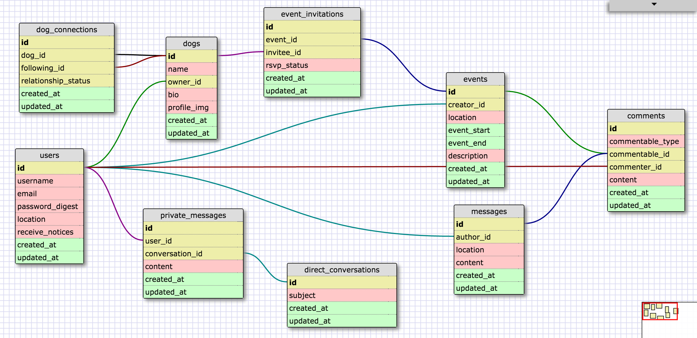

 

# hey-9
*the four-legged social network*

App live on Heroku: (hey-9.herokuapp.com)

Hey-9 exists to elevate the social situation of our beloved counterparts.

### Team members:

Wyeth Jackson - https://github.com/wyethjackson

Chris - https://github.com/cMzeta

Alexis Moody - https://github.com/amoody2108

Larissa Pittenger - https://github.com/mslarissaaa

Rodica Trifan - https://github.com/trodicaro

### Schema:

